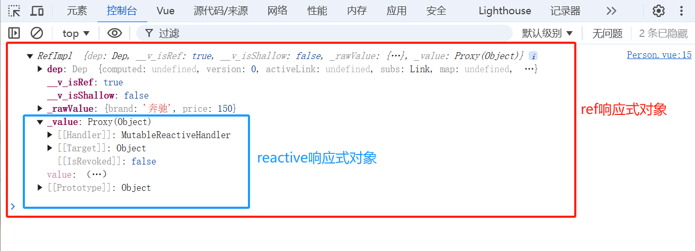

## 1、`ref` 和  `reactive` 的基本区别

`ref` >> 可以定义:基本类型、对象类型的响应式数据

`reactive` >> 只能定义:对象类型的响应式数据

## 2、底层分析

> let car = ref({brand:"奔驰",price:100})

在使用 `ref` 创建响应式对象时，它本质上是将对象类型创建为 `reactive` 对象，并封装到 `.value` 之中
