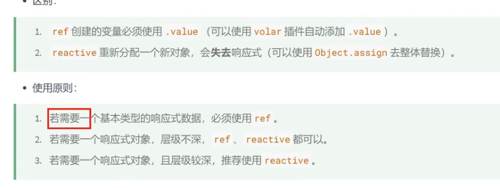

## 1、区别

path : `./备份/src_6`

`ref` 创建的变量必须使用 `.value`

`reactive` 重新分配一个新对象，就会失去响应式
（可以使用 `Object.assign` 去整体替换 ）

## 2、使用原则

若需要使用一个基本类型的响应式数据，必须使用 `ref`

若需要一个响应式对象，层级不深，`ref` 、 `reactive` 都可以

若需要一个响应式对象，且层级比较深，推荐使用 `reactive`

## 3、概括

